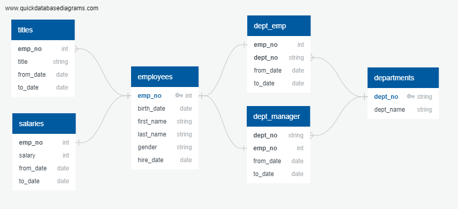

# sql-challenge

## SQL project

### First Part of the project

The first steps for this proyect you will need to create and import to a PostgreSQL DataBase the CSV files using the following Data Base schema:

Or you simply can run this SQL scrip [Employees_Final.sql](EmployeeSQL/Employees_Final.sql)

The files to import are the next ones and in this order:
1. [employees.csv](data/employees.csv)
2. [departments.csv](data/departments.csv)
3. [titles.csv](data/titles.csv) and [salaries.csv](data/salaries.csv)
4. [dept_emp.csv](data/dept_emp.csv) and [dept_manager.csv](data/dept_manager.csv)

Once with all the data in the Employe PostgreSQL Data Base, you can proceed to open a Query Tool and try the next sql queries file:
* [SQL-Challenge_AnswersScript.sql](EmployeeSQL/SQL-Challenge_AnswersScript.sql)

#### For the bonus part of the challenge

For the bonus part of the challenge I included a Jupyter Notebook [SQL-Challenge.ipynb](SQL-Challenge.ipynb) that you can run to get the answers, but be careful because you need to have the next information in order to run:

Installed libraries on your environment: 
* pandas
* sqlalchemy
* psycopg2
* matplotlib.pyplot

And for the database connection:
* Adress (server IP, if runs on your machine localhost or 127.0.0.1)
* Port (could be 5432)
* Username (default is postgres)
* Password (your PGAdmin4 password)
* DBName (in this case "Employees")

### Have fun!
